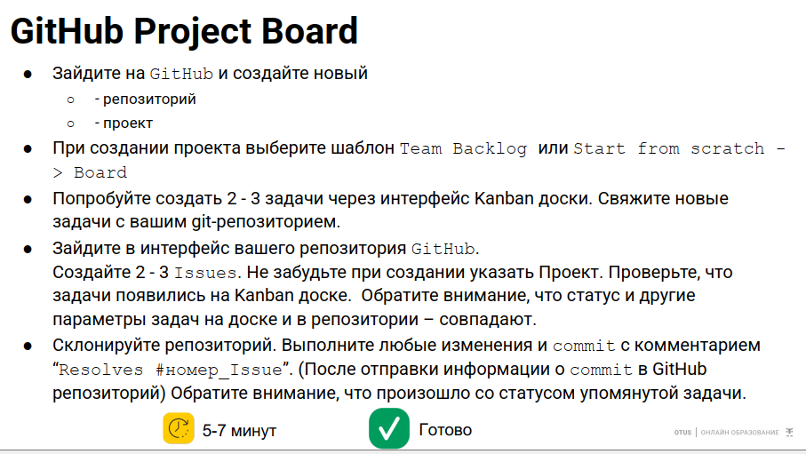
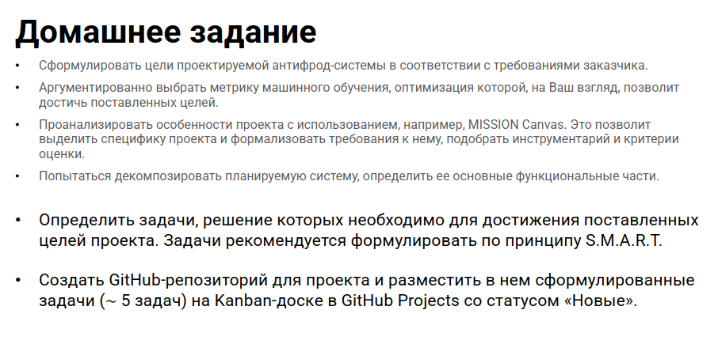

# MLops_antifrod_ex

## Наша задача:

1. Сформулировать цели планируемой антифрод системы
2. Выбрать метрики, в том числе ML
3. Проанализировать особенности с помощью MISSION Canvas
4. Декомпозировать систему, определить её функцион. части
5. Определить задачи по SMART. Сформировать RoadMAP
6. Создатьт GitHub репо для проекта и разместить там задачи на Kanban доске со статусом новые

## Параметры:

- Бюджет: 10 млн (без зарплат)
- Time:
    - 3 месяца - первые результаты
    - 6 месяцев - завершить
- Конкуренты:
    - 500 тысяч совокупный ущерб в месяц
- В среднем 50 транзак. в сек., max - 400 в сек
    - 86400 мошен. транзакций в сутки
- FalsePositive < 5%
- FalseNegative < 2%
- Система должна быть во внешнем контуре
- Передаваться будут csv файлы

