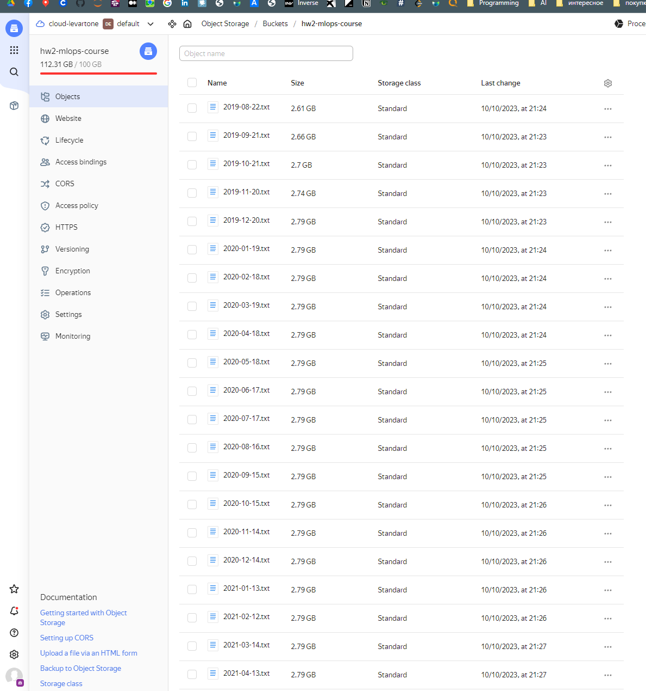
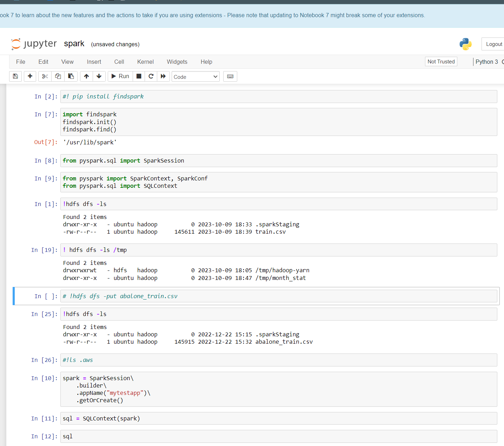
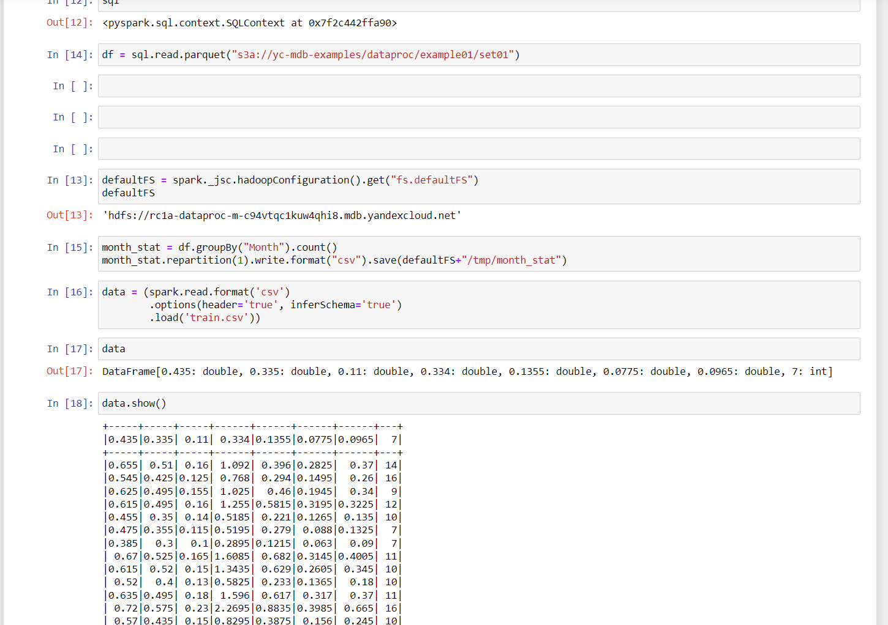
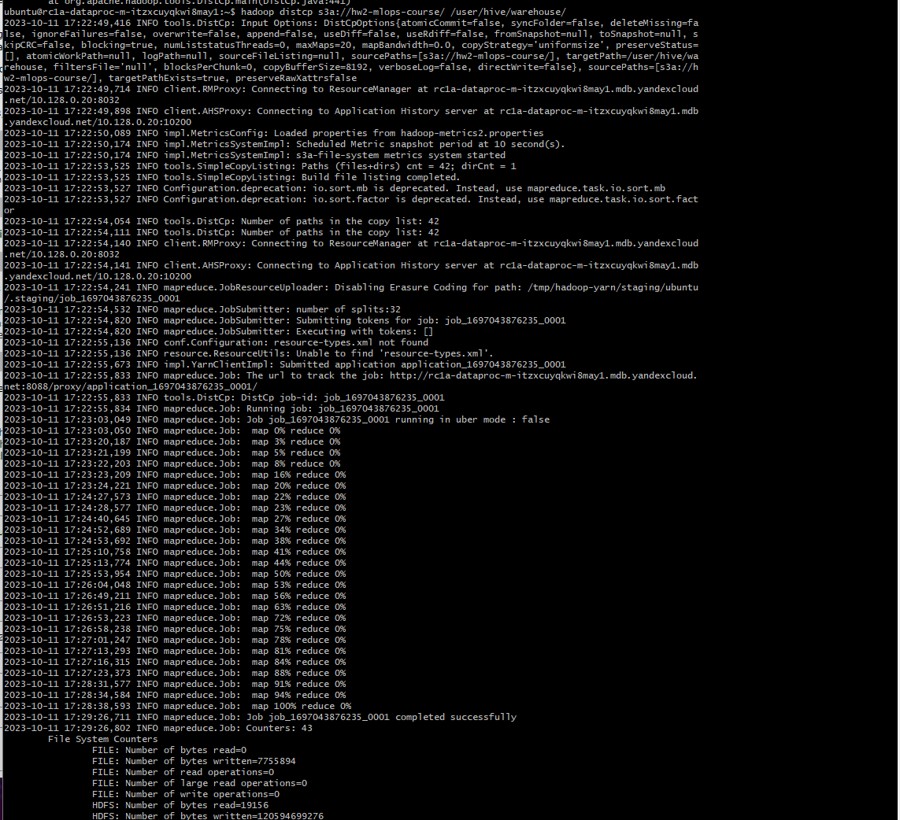
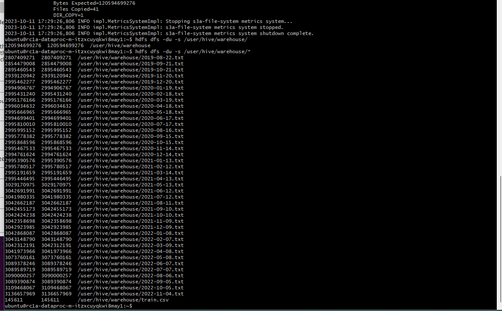
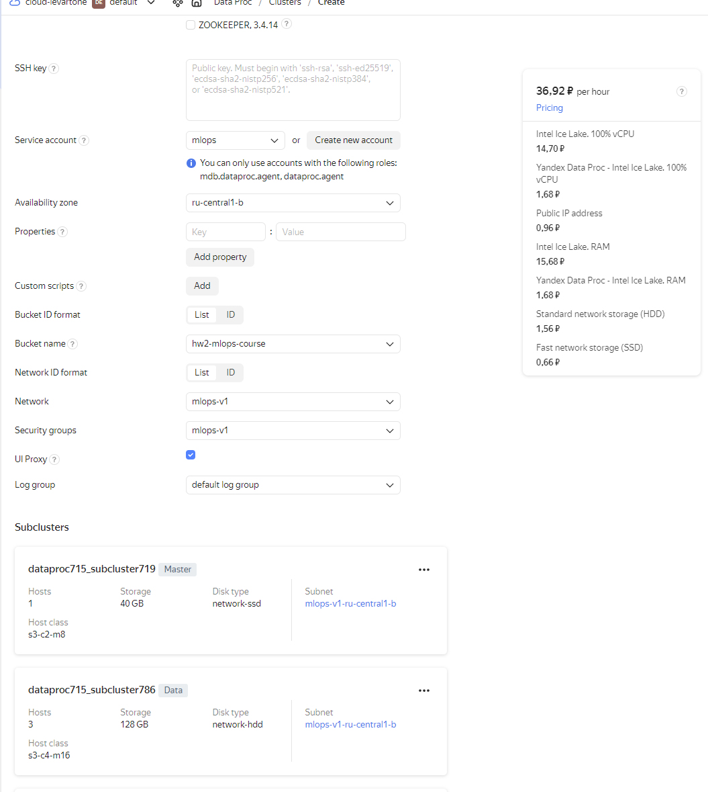
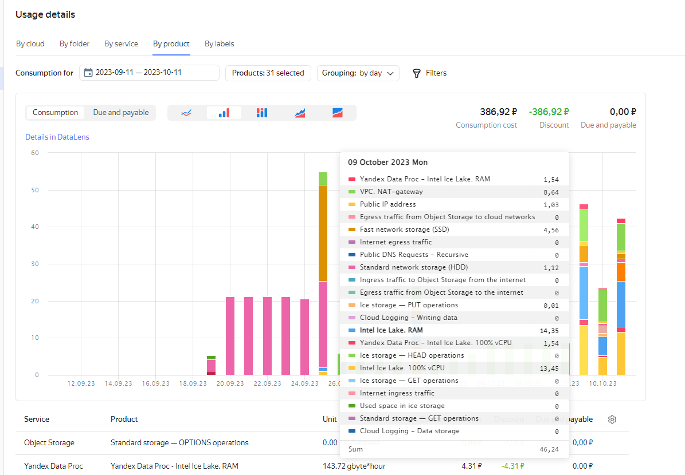

# Цели домашнего задания:
1. Создать Object Storage.
2. Перенести из public s3 в созданное нашими руками.
3. Создать Spark-cluster.
4. Скопировать из нашего s3 в HDFS кластера. 
5. Оценить затраты на кластер.
6. Попробовать сэкономить. 
7. Изменить статус задач на Канбан доске в GitHub Projects. 

# Первый и второй пункт (s3 Облако):
ссылка на созданное облако: (https://storage.yandexcloud.net/hw2-mlops-course/)

# Третий пункт (Создать Spark-cluster)
В общем-то, я не только создал кластер, но и погонял на нем Spark. 

# Четвертый пункт (копируем из S3 в HDFS)

# Пятый пункт (Оценить затраты на кластер)

Как видно из скриншота, наш кластер будет стоить 36.92 руб за час, или 36.92 * 24 * 30 = 26582 руб в месяц

# Шестой пункт (сэкономим?)

Я смотрел детализацию, а также сколько можно сэкономить, но там в целом все прям немного.
Поэтому я решил на это время прям не тратить. У нас итак по минимуму всего. 

# Статусы на канбан доске

В GitHub project: (https://github.com/users/Aleverkin/projects/1)

