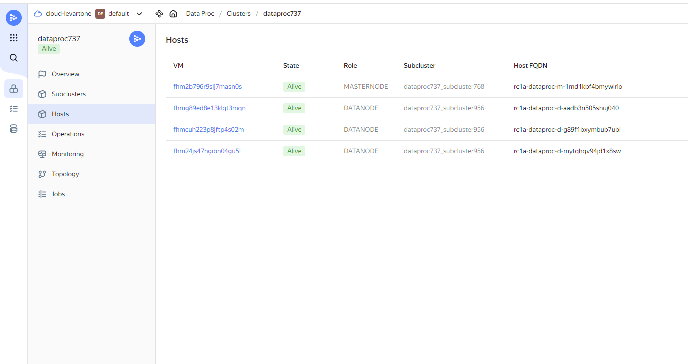

# 1. Кластер создан:

# 2. Найдены следующие ошибки в данных

Исследование проведено в ноутбуке **HW3_Research.ipynb**

1. поле customer_id имеет пропуски (Null значения)
2. поле customer_id имеет отрицательные значения
3. в полях ['tx_amount', 'tx_time_days', 'tx_time_seconds'] есть выбросы (в 100 раз больше 99% перцентиля)
4. даты строк в файлах не всегда совпадают с названиями файлов
5. кол-во секунд и кол-во дней не всегда совпадает

# 3. данные почищены

Обработка проведена скриптом **clean_data.py**

# 4. данные сохранены

В формате parquet в облако по ссылке: https://console.cloud.yandex.ru/folders/b1gilbgnehsgl98d6bp9/storage/buckets/mlops-parsed-data
