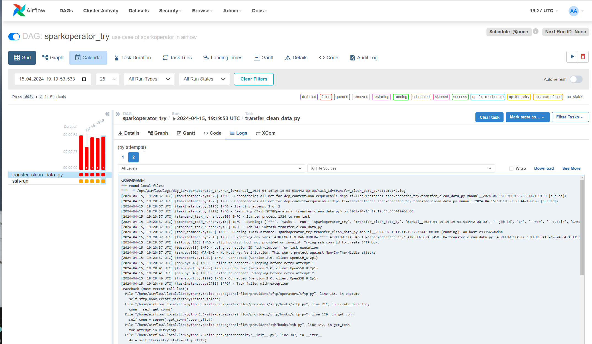
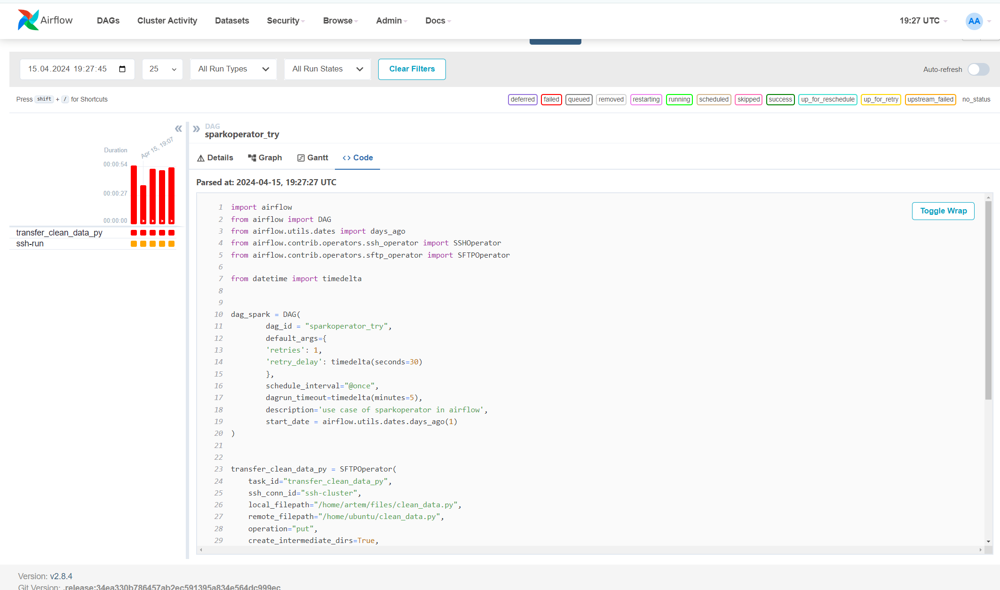

# 1 Создать Airflow в Docker на виртуалке

# 2 Написать скрипт по отчистке данных

Это файл clean_data.py

# 3 Написать и загрузить ДАГ в airflow

Это файл dag_HW.py

# 4 Запустить и потестить

не работает SFTP оператор, вылетает ошибка при попытке скопировать на кластер файл запуска.
Пишет ошибку описанную ниже. Это ошибка типо ssh ключ не тот. Но с самой виртуалки с Airflow
просто используя ssh утилиту я без проблем захожу на кластер. А SFTP оператор выдает ошибку.
SSH публичный ключ кластеру я отдавал именно ключ виртуалки Я.Облака.

# Полный текст ошибки:

c93956506db4
*** Found local files:
***   * /opt/airflow/logs/dag_id=sparkoperator_try/run_id=manual__2024-04-15T19:15:52.979075+00:00/task_id=transfer_clean_data_py/attempt=2.log
[2024-04-15, 19:16:35 UTC] {taskinstance.py:1979} INFO - Dependencies all met for dep_context=non-requeueable deps ti=<TaskInstance: sparkoperator_try.transfer_clean_data_py manual__2024-04-15T19:15:52.979075+00:00 [queued]>
[2024-04-15, 19:16:35 UTC] {taskinstance.py:1979} INFO - Dependencies all met for dep_context=requeueable deps ti=<TaskInstance: sparkoperator_try.transfer_clean_data_py manual__2024-04-15T19:15:52.979075+00:00 [queued]>
[2024-04-15, 19:16:35 UTC] {taskinstance.py:2193} INFO - Starting attempt 2 of 2
[2024-04-15, 19:16:35 UTC] {taskinstance.py:2217} INFO - Executing <Task(SFTPOperator): transfer_clean_data_py> on 2024-04-15 19:15:52.979075+00:00
[2024-04-15, 19:16:35 UTC] {standard_task_runner.py:60} INFO - Started process 1231 to run task
[2024-04-15, 19:16:35 UTC] {standard_task_runner.py:87} INFO - Running: ['***', 'tasks', 'run', 'sparkoperator_try', 'transfer_clean_data_py', 'manual__2024-04-15T19:15:52.979075+00:00', '--job-id', '12', '--raw', '--subdir', 'DAGS_FOLDER/dag_HW.py', '--cfg-path', '/tmp/tmpwba4v543']
[2024-04-15, 19:16:35 UTC] {standard_task_runner.py:88} INFO - Job 12: Subtask transfer_clean_data_py
[2024-04-15, 19:16:35 UTC] {task_command.py:423} INFO - Running <TaskInstance: sparkoperator_try.transfer_clean_data_py manual__2024-04-15T19:15:52.979075+00:00 [running]> on host c93956506db4
[2024-04-15, 19:16:35 UTC] {taskinstance.py:2513} INFO - Exporting env vars: AIRFLOW_CTX_DAG_OWNER='***' AIRFLOW_CTX_DAG_ID='sparkoperator_try' AIRFLOW_CTX_TASK_ID='transfer_clean_data_py' AIRFLOW_CTX_EXECUTION_DATE='2024-04-15T19:15:52.979075+00:00' AIRFLOW_CTX_TRY_NUMBER='2' AIRFLOW_CTX_DAG_RUN_ID='manual__2024-04-15T19:15:52.979075+00:00'
[2024-04-15, 19:16:35 UTC] {sftp.py:158} INFO - sftp_hook/ssh_hook not provided or invalid. Trying ssh_conn_id to create SFTPHook.
[2024-04-15, 19:16:35 UTC] {base.py:83} INFO - Using connection ID 'sftp-cluster' for task execution.
[2024-04-15, 19:16:35 UTC] {ssh.py:301} WARNING - No Host Key Verification. This won't protect against Man-In-The-Middle attacks
[2024-04-15, 19:16:35 UTC] {transport.py:1909} INFO - Connected (version 2.0, client OpenSSH_8.2p1)
[2024-04-15, 19:16:35 UTC] {ssh.py:343} INFO - Failed to connect. Sleeping before retry attempt 1
[2024-04-15, 19:16:39 UTC] {transport.py:1909} INFO - Connected (version 2.0, client OpenSSH_8.2p1)
[2024-04-15, 19:16:39 UTC] {ssh.py:343} INFO - Failed to connect. Sleeping before retry attempt 2
[2024-04-15, 19:16:42 UTC] {transport.py:1909} INFO - Connected (version 2.0, client OpenSSH_8.2p1)
[2024-04-15, 19:16:42 UTC] {taskinstance.py:2731} ERROR - Task failed with exception
Traceback (most recent call last):
  File "/home/airflow/.local/lib/python3.8/site-packages/airflow/providers/sftp/operators/sftp.py", line 185, in execute
    self.sftp_hook.create_directory(remote_folder)
  File "/home/airflow/.local/lib/python3.8/site-packages/airflow/providers/sftp/hooks/sftp.py", line 211, in create_directory
    conn = self.get_conn()
  File "/home/airflow/.local/lib/python3.8/site-packages/airflow/providers/sftp/hooks/sftp.py", line 126, in get_conn
    self.conn = super().get_conn().open_sftp()
  File "/home/airflow/.local/lib/python3.8/site-packages/airflow/providers/ssh/hooks/ssh.py", line 347, in get_conn
    for attempt in Retrying(
  File "/home/airflow/.local/lib/python3.8/site-packages/tenacity/__init__.py", line 347, in __iter__
    do = self.iter(retry_state=retry_state)
  File "/home/airflow/.local/lib/python3.8/site-packages/tenacity/__init__.py", line 325, in iter
    raise retry_exc.reraise()
  File "/home/airflow/.local/lib/python3.8/site-packages/tenacity/__init__.py", line 158, in reraise
    raise self.last_attempt.result()
  File "/usr/local/lib/python3.8/concurrent/futures/_base.py", line 437, in result
    return self.__get_result()
  File "/usr/local/lib/python3.8/concurrent/futures/_base.py", line 389, in __get_result
    raise self._exception
  File "/home/airflow/.local/lib/python3.8/site-packages/airflow/providers/ssh/hooks/ssh.py", line 354, in get_conn
    client.connect(**connect_kwargs)
  File "/home/airflow/.local/lib/python3.8/site-packages/paramiko/client.py", line 485, in connect
    self._auth(
  File "/home/airflow/.local/lib/python3.8/site-packages/paramiko/client.py", line 819, in _auth
    raise SSHException("No authentication methods available")
paramiko.ssh_exception.SSHException: No authentication methods available
During handling of the above exception, another exception occurred:
Traceback (most recent call last):
  File "/home/airflow/.local/lib/python3.8/site-packages/airflow/models/taskinstance.py", line 444, in _execute_task
    result = _execute_callable(context=context, **execute_callable_kwargs)
  File "/home/airflow/.local/lib/python3.8/site-packages/airflow/models/taskinstance.py", line 414, in _execute_callable
    return execute_callable(context=context, **execute_callable_kwargs)
  File "/home/airflow/.local/lib/python3.8/site-packages/airflow/providers/sftp/operators/sftp.py", line 191, in execute
    raise AirflowException(f"Error while transferring {file_msg}, error: {e}")
airflow.exceptions.AirflowException: Error while transferring None, error: No authentication methods available
[2024-04-15, 19:16:42 UTC] {taskinstance.py:1149} INFO - Marking task as FAILED. dag_id=sparkoperator_try, task_id=transfer_clean_data_py, execution_date=20240415T191552, start_date=20240415T191635, end_date=20240415T191642
[2024-04-15, 19:16:42 UTC] {standard_task_runner.py:107} ERROR - Failed to execute job 12 for task transfer_clean_data_py (Error while transferring None, error: No authentication methods available; 1231)
[2024-04-15, 19:16:42 UTC] {local_task_job_runner.py:234} INFO - Task exited with return code 1
[2024-04-15, 19:16:42 UTC] {taskinstance.py:3312} INFO - 0 downstream tasks scheduled from follow-on schedule check